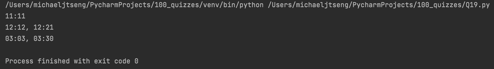

```.py
def q19(n:int)->str:
    result = ''
    reversed = str(n)[::-1]
    if n > 24:
        result = 'NONE'
    elif n < 10:
        result = f'0{n}:0{n}, 0{n}:{n}0'
    elif int(reversed) > 60 or int(reversed) == n:
        result = f'{n}:{n}'
    else:
        result = f'{n}:{n}, {n}:{reversed}'
    return result

print(q19(n=11))
print(q19(n=12))
print(q19(n=3))
```


