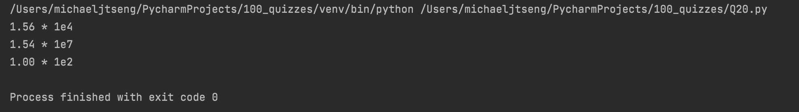
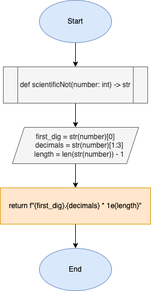

# Quiz 20

### Code
```.py
def scientificNot(number: int) -> str:
    # take the first 3 sf from number using indexing
    first_dig = str(number)[0]
    decimals = str(number)[1:3]
    length = len(str(number)) - 1

    return f"{first_dig}.{decimals} * 1e{length}"


print(scientificNot(15600))
print(scientificNot(15470000))
print(scientificNot(100))

```

### Test


### Flowchart

