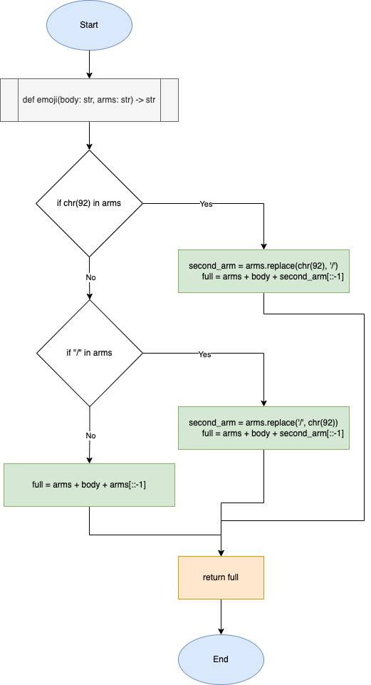

# Quiz 21

### Code
```.py
def emoji(body: str, arms: str) -> str:
    """
    This program takes an input of a emoji body, and 1 arm. It outputs the emoji with both arms.
    """
    # Check if "\" character is in the arm
    if chr(92) in arms:
        # If so, replace "\" with its reversed counterpart, "/"
        second_arm = arms.replace(chr(92), '/')
        full = arms + body + second_arm[::-1]
    # Check if "/" character is in the arm
    elif "/" in arms:
        # If so, replace "/" with its reversed counterpart, "\"
        second_arm = arms.replace('/', chr(92))
        full = arms + body + second_arm[::-1]
    else:
        full = arms + body + arms[::-1]
    return full

print(emoji("(o~o)", "|-"))
print(emoji("(I~I)", "/---|"))
```

### Test


### Flowchart

