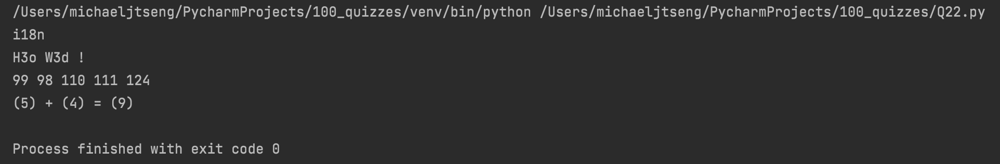
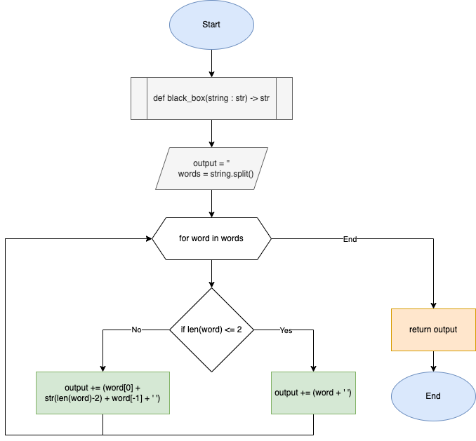

# Quiz 22

### Code

```.py
def black_box(string : str) -> str:
    '''
    This program outputs words with the middle replaced with its length of letters
    '''
    output = ''
    words = string.split() # list of all individual words
    for word in words:
        if len(word) <= 2: # if length of word is less than 2, output word as normal
            output += (word + ' ')
        else:
            output += (word[0] + str(len(word)-2) + word[-1] + ' ')

    return output


print(black_box("internationalization"))
print(black_box("Hello World !"))
print(black_box("99 98 100 101 1304"))
print(black_box("(codin) + (game) = (codingame)"))
```

### Test



### Flowchart


