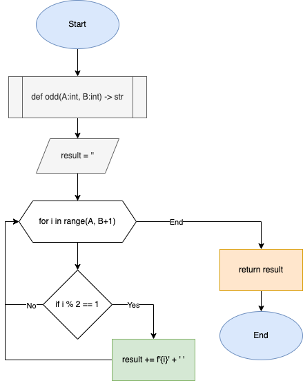

# Quiz 23

### Code

```.py
def odd(A:int, B:int) -> str:
    '''
    This program returns all the odd numbers within a range of A to B
    '''
    result = ''
    for i in range(A, B+1):
        if i % 2 == 1:
            result += f'{i}' + ' '
    return result

print(odd(5, 10))
print(odd(10, 21))
```

### Test

### Flowchart


