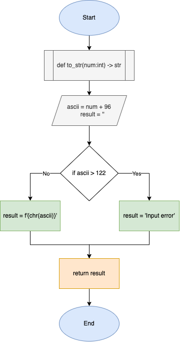

# Quiz 24

### Code

```.py
def to_str(num:int) -> str:
    ascii = num + 96
    result = ''
    if ascii > 122:
        result = 'Input error'
    else:
        result = f'{chr(ascii)}'
    return result

print(to_str(1))
print(to_str(26))
print(to_str(30))
```

### Test


### Flowchart


